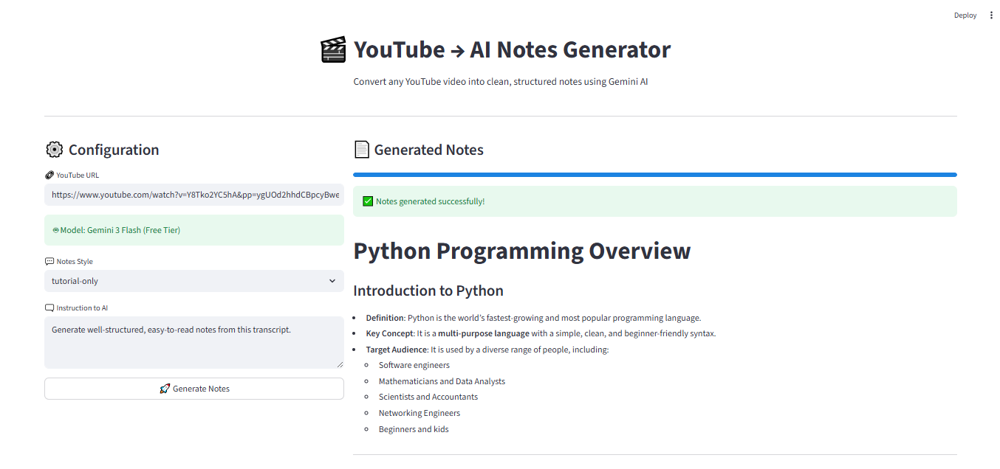

# 🎬 YouTube → AI Notes Generator

An AI-powered tool that converts YouTube videos into clean, structured, and easy-to-read notes using **Google Gemini**.

Instead of downloading audio, this application extracts the video transcript and processes it with Gemini to generate high-quality notes quickly and efficiently.

---

## 📸 Screenshots

<p align="center">
  
</p>

<p align="center">
  
</p>

---

## ✨ Features

* ⚡ Transcript-based processing (no audio download required)
* 🧠 Powered by Google Gemini (Flash free-tier supported)
* 📝 Structured and organized note generation
* 🎯 Multiple note styles:

  * Tutorial-based format
  * Class/Lecture format
  * Custom prompt option
* 📥 Export notes as Markdown
* 🖥️ Clean and intuitive Streamlit UI

---

## 🏗️ Architecture Overview

```
YouTube Video
      ↓
Transcript Extraction (yt-dlp)
      ↓
Text Cleaning & Processing
      ↓
Gemini AI (generate_content)
      ↓
Structured Notes Output
```

This approach avoids audio processing, reduces latency, and improves efficiency.

---

## 🚀 Installation

### 1️⃣ Clone the Repository

```bash
git clone https://github.com/ShivamAttri05/Youtube-AI-Notes-Generator.git
cd Youtube-AI-Notes-Generator
```

### 2️⃣ Create a Virtual Environment

```bash
python -m venv venv
```

### 3️⃣ Activate the Environment

**Windows**

```bash
venv\Scripts\activate
```

**Mac/Linux**

```bash
source venv/bin/activate
```

### 4️⃣ Install Dependencies

```bash
pip install -r requirements.txt
```

---

## 🔑 Environment Setup

Create a `.env` file in the project root. You can copy the provided example:

```bash
cp .env.example .env
```

Then edit `.env` and set:

```
GOOGLE_API_KEY=your_api_key_here
```

You can obtain a Gemini API key from:

👉 [https://ai.google.dev/](https://ai.google.dev/)

---

## ▶️ Run the Application

```bash
streamlit run app.py
```

Then open:

```
http://localhost:8501
```

Paste a YouTube URL and generate structured notes instantly.

---

## ⚠️ Limitations

* Requires videos with available subtitles
* English subtitles recommended
* Very long transcripts may require chunking (future improvement)

---

## 📌 Future Improvements

* Transcript → Audio fallback mechanism
* Language selection support
* Automatic topic detection
* Transcript chunking for long videos
* Deployment support (Streamlit Cloud / Docker)

---

## 🤝 Contributing

Contributions are welcome.
Feel free to open an issue or submit a pull request.

---

## ⭐ Support

If you found this project helpful, consider giving it a star ⭐ on GitHub.

---
