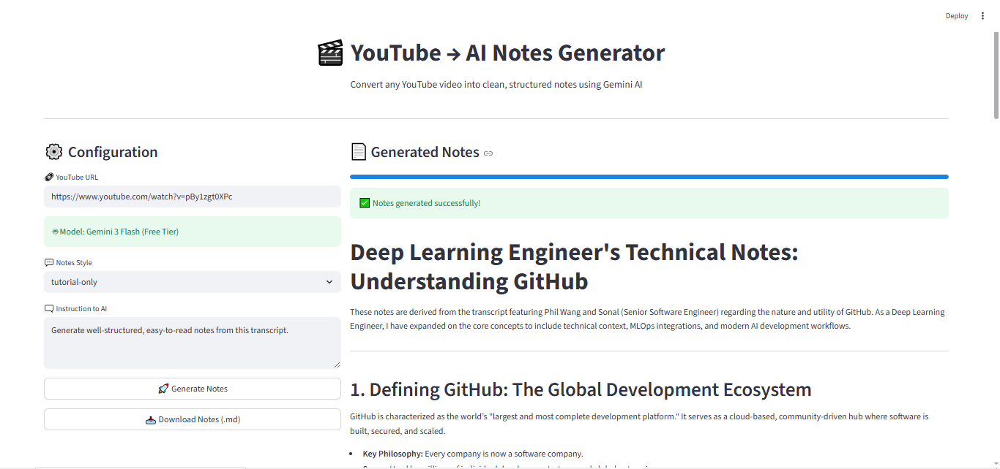

# YouTube Notes Generator

This project generates structured and high-quality notes from YouTube videos using Google Gemini AI.

Instead of downloading audio, it extracts the video transcript and sends it to Gemini to generate well-organized notes. This makes the system faster and more efficient.

---
## Screen Shot



## Features

* Generate structured notes from YouTube videos
* Uses video transcripts (no audio download required)
* Powered by Google Gemini (Flash free-tier supported)
* Multiple note styles:

  * Tutorial-based notes
  * Class/lecture-style notes
  * Custom prompt option
* Download notes as a Markdown file
* Simple UI built with Streamlit

---

## How It Works

1. Extract transcript from the YouTube video
2. Clean and process the text
3. Send transcript to Gemini
4. Generate structured notes

No audio processing. No FFmpeg required.

---

## Installation

### 1. Clone the repository

```bash
git clone https://github.com/ShivamAttri05/Youtube-AI-Notes-Generator.git
cd youtube-notes-generator
```

### 2. Create a virtual environment

```bash
python -m venv venv
```

### 3. Activate the virtual environment

**Windows:**

```bash
venv\Scripts\activate
```

**Mac/Linux:**

```bash
source venv/bin/activate
```

### 4. Install dependencies

```bash
pip install -r requirements.txt
```

---

## Environment Setup

Create a `.env` file in the root directory and add:

```
GOOGLE_API_KEY=your_api_key_here
```

You can get your Gemini API key from:
[https://ai.google.dev/](https://ai.google.dev/)

---

## Run the Application

```bash
streamlit run app.py
```

Then open:

```
http://localhost:8501
```

Paste a YouTube link and generate notes.

---

## Model Used

Recommended for free usage:

```
gemini-3-flash-preview
```

---

## Limitations

* Requires videos with available subtitles
* English subtitles recommended
* Very long videos may need transcript chunking

---

## Contributing

Feel free to open issues or submit pull requests.

---